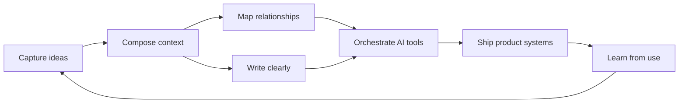

  
  
  

  

  

---

### Signal

I am building **Basehalf**, a compound-thinking workspace where ideas accumulate, connect, and grow.

My work blends product design, full-stack engineering, and AI workflow design. I like systems that make messy thinking visible: canvases, editors, graphs, context pipelines, and tools that help people navigate their own work.

  

### What I Am Shaping

| Track | Direction |
| --- | --- |
| **Product surface** | Canvas-first knowledge work, dense editor flows, graph exploration, collaboration |
| **AI layer** | Tool calling, context composition, agent-facing workflows, review loops |
| **System design** | TypeScript services, Prisma-backed data models, explicit contracts, operational workflows |
| **Taste** | Calm interfaces, legible state, small verifiable changes, polish as correctness |

### Build Loop

### Stack

  
  
  
  
  
  
  
  
  

### GitHub Motion

  
  

  

  

  <picture>
    <source media="(prefers-color-scheme: dark)" srcset="https://raw.githubusercontent.com/aron-76/aron-76/output/github-snake-dark.svg">
    <source media="(prefers-color-scheme: light)" srcset="https://raw.githubusercontent.com/aron-76/aron-76/output/github-snake.svg">
    
  </picture>

  

### Working Principles

- Keep product intent close to implementation details.
- Prefer small, verifiable changes over large rewrites.
- Make systems legible for both people and agents.
- Treat polish as part of correctness.

---

  <a href="https://github.com/aron-76">GitHub</a>
  /
  <a href="mailto:chouarslan@gmail.com">Email</a>

