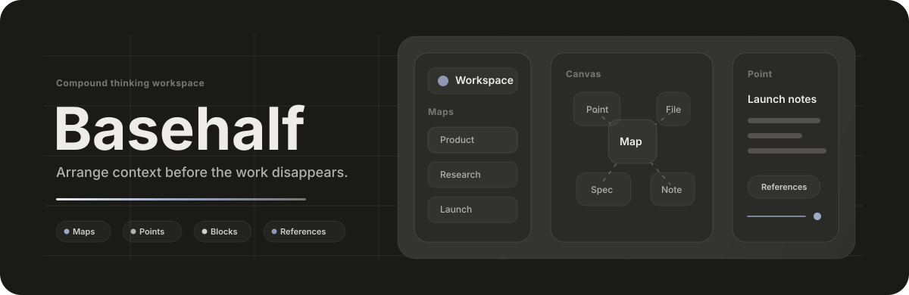

  

### Hi, I am Aron

I am building **Basehalf**, a workspace for turning scattered project context into something you can arrange, edit, and return to.

The product starts from a simple problem I keep running into: good work leaves traces everywhere. Notes, files, decisions, drafts, and half-formed ideas all need a place to become useful again.

### Basehalf

Basehalf is built around a few plain objects:

- **Maps** are rooms for a project, topic, or angle of thinking.
- **Points** are small workspaces for notes, files, blocks, and decisions.
- **Blocks** are editable pieces of work that can outlive the session that produced them.
- **References** are explicit links that say what belongs together.

### On My Desk

- Making the map canvas feel calm when a project gets dense.
- Turning point documents into a reliable place for specs, notes, and working memory.
- Tightening collaboration and persistence with TypeScript, React, BlockNote, Yjs, Prisma, and PostgreSQL.
- Designing details that make the next useful action obvious.

### Build Log

  

### Working Principles

- Show the structure before automating it.
- Prefer editable objects over throwaway chat.
- Keep design intent close to implementation details.
- Build tools that make work easier to resume.

---

  <a href="https://github.com/aron-76">GitHub</a>
  /
  <a href="mailto:chouarslan@gmail.com">Email</a>

