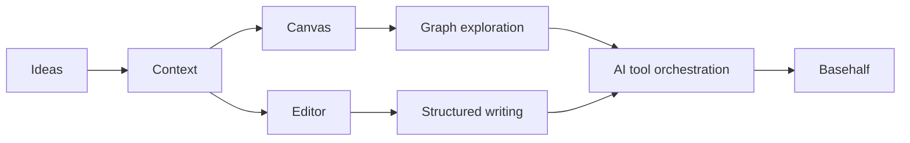

  
  
  

  

---

### About

I am building **Basehalf**, a compound-thinking workspace where ideas accumulate, connect, and grow.

My work sits at the intersection of product design, full-stack systems, and AI-assisted knowledge workflows. I care about interfaces that expose complex state clearly, backends with legible boundaries, and AI features that are shaped around real product use instead of demos.

### Current Focus

### Toolbox

| Area | Stack |
| --- | --- |
| **Frontend** |     |
| **Product Surface** |     |
| **Backend** |     |
| **AI Systems** |    |
| **Workflow** |     |

### GitHub Activity

  
  

  

  

  

### Working Principles

- Keep product intent close to implementation details.
- Prefer small, verifiable changes over large rewrites.
- Make systems legible for both people and agents.
- Treat polish as part of correctness.

---

  <a href="https://github.com/aron-76">GitHub</a>
  ·
  <a href="mailto:chouarslan@gmail.com">Email</a>

