<p align="center">
  
</p>

<p align="center">
  <a href="https://github.com/aron-76/aron-76">
    
  </a>
  <a href="mailto:chouarslan@gmail.com">
    
  </a>
  
</p>

<p align="center">
  <a href="https://git.io/typing-svg">
    
  </a>
</p>

---

### Building Basehalf

I am building **Basehalf**, an AI-native workspace where ideas become durable context.

Most AI tools treat conversation as the product. Basehalf treats conversation as the process: the useful parts become editable blocks, points become reusable memory, and references define what AI can see.

```txt
Map folders -> Map canvas -> Point documents -> References -> AI context
```

### Product System

| Layer | What it does |
| --- | --- |
| **Maps** | Organize work by perspective, not by rigid hierarchy. |
| **Points** | Act as atomic workspaces for notes, files, blocks, and AI memory. |
| **References** | Compose context across points so AI can read a connected knowledge graph. |
| **Blocks** | Turn useful AI output into editable, durable product artifacts. |
| **Agents** | Read and write the same structures humans use, with visible provenance. |

### Current Focus

<p>
  
  
  
  
  
  
  
  
</p>

- Product interfaces for dense knowledge work, not marketing surfaces.
- Context composition, reference graphs, and long-lived AI memory.
- Agent-friendly tools where UI actions and AI actions share the same data model.
- Reliable collaboration and persistence with BlockNote, Yjs, and service boundaries.

### GitHub Signal

<p align="center">
  
</p>

<p align="center">
  
  
</p>

### Working Principles

- Make context visible before making it automatic.
- Treat AI output as material that should become editable structure.
- Keep product intent close to implementation details.
- Build systems that are legible to both humans and agents.

---

<p align="center">
  <a href="https://github.com/aron-76">GitHub</a>
  /
  <a href="mailto:chouarslan@gmail.com">Email</a>
</p>
