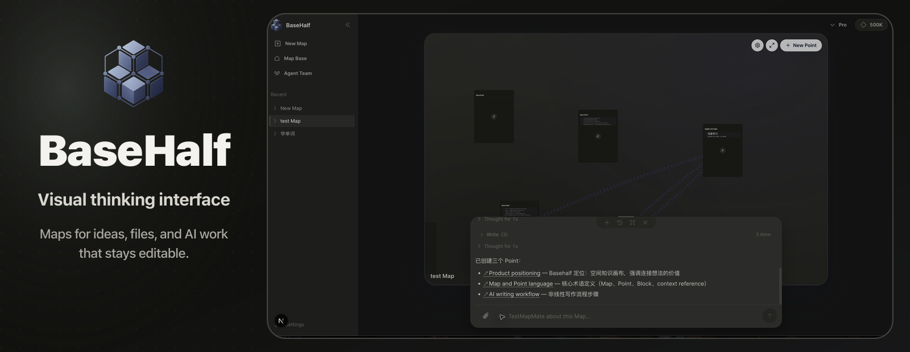

  

### Hi, I am Jerry

I am building **Basehalf**, a visual thinking interface for the AI era.

Instead of leaving useful AI work trapped in chat, Basehalf gives each project a Map: a surface where ideas, files, decisions, and questions can be arranged as Points. Open a Point and it becomes a durable page, where you and AI can write, revise, and keep the context connected.

### How It Works

A **Map** is the visual field. A **Point** is one focused place on that field. Inside a Point, editable **Blocks** become the record of work. **References** connect related Points so AI can follow the shape of the project instead of only the last message.

- **Map**: where a line of thinking becomes visible.
- **Point**: one idea, file, question, task, or decision you can open and keep building.
- **Block**: editable material written by you or AI.
- **Reference**: a context link between Points.

### Current Focus

- Building Agent Team as an organization structure for AI, using Point references to amplify direction into deliverables.
- Refining the Basehalf experience so Maps, Points, Blocks, and AI work feel simple to use.

### Tech Stack

  
  
  
  
  
  
  
  
  
  
  
  
  
  
  
  

### Build Log

  

